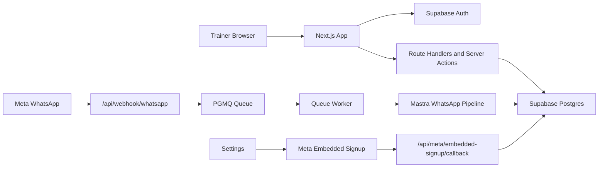

# NutriRelay

NutriRelay is a trainer-facing nutrition operations app for WhatsApp-first meal logging, review queues, adherence tracking, and report preparation.

Live site: https://nutrirelay.in

## Stack

- Next.js App Router 16
- React 19
- TypeScript
- Tailwind CSS 4
- Supabase Auth and Postgres
- Supabase SSR
- Vercel
- Vitest
- Mastra workflows
- Trigger.dev SDK
- Meta WhatsApp Cloud API webhook and Embedded Signup integration code

## Architecture



## Key Workflows

- Public landing page for trainer-facing positioning.
- Supabase email/password registration and login.
- Middleware-protected dashboard routes.
- Trainer dashboard for clients, inbox/communications, reports, analytics, reviews, events, settings, and WhatsApp development tools.
- Trainer-scoped client access through authenticated route handlers and ownership checks.
- WhatsApp webhook ingestion, status persistence, queue processing, and AI-assisted meal parsing.
- Embedded Signup callback for saving WABA and phone metadata under the authenticated trainer.

## Local Development

```bash
npm install
npm run dev
```

Open `http://localhost:3000`.

## Verification

```bash
npx tsc --noEmit --pretty false --incremental false
npm run lint
npm test
npm run build
```

## Environment Variable Names

Values are intentionally omitted. Do not commit `.env.local`.

```text
NEXT_PUBLIC_SUPABASE_URL
NEXT_PUBLIC_SUPABASE_ANON_KEY
SUPABASE_SERVICE_ROLE_KEY
DATABASE_URL
DATABASE_DIRECT_URL
WHATSAPP_APP_SECRET
WHATSAPP_VERIFY_TOKEN
META_APP_ID
NEXT_PUBLIC_META_APP_ID
META_APP_SECRET
META_EMBEDDED_SIGNUP_CONFIG_ID
NEXT_PUBLIC_META_EMBEDDED_SIGNUP_CONFIG_ID
META_GRAPH_API_VERSION
GOOGLE_GENERATIVE_AI_API_KEY
RESEND_API_KEY
TELEGRAM_BOT_TOKEN
TELEGRAM_TRAINER_CHAT_ID
NEXT_PUBLIC_APP_URL
CRON_SECRET
LOG_LEVEL
TRIGGER_SECRET_KEY
```

## Database

- Migrations live in `supabase/migrations`.
- Core tenant model uses `profiles`, `trainer_clients`, meal/report tables, WhatsApp credential tables, and webhook/status logging tables.
- RLS policies are defined in migrations and should be validated in a disposable dev/staging project before production changes.
- Do not run `supabase db push` against production without explicit approval.

## QA Artifacts

- Test plan: `qa/test-plan.md`
- Auth cases: `qa/auth-test-cases.md`
- RLS cases: `qa/rls-test-cases.md`
- API checklist: `qa/api-checklist.md`
- Sample bug reports: `qa/bug-report-examples.md`
- Sanitized Postman collection: `qa/postman/nutrirelay-api.postman_collection.json`
- Recruiter-facing case study: `docs/nutrirelay-case-study.md`

## Security Notes

- Browser code may use only `NEXT_PUBLIC_*` values.
- Meta app secrets, WhatsApp access tokens, and Supabase service-role keys must remain server-side.
- Trainer API routes should resolve trainer identity from authenticated session context.
- Service-role database access bypasses RLS, so route-level authentication and ownership checks are mandatory.
- Screenshots, docs, logs, and Postman collections must not include real secrets or private client data.

## Current Limitations

- Billing is manual QR/UPI/operator verification, not a live payment gateway.
- Live WhatsApp completion should not be claimed without verified send, delivery/read status, inbound reply, and dashboard persistence evidence.
- Public repository/case-study sharing should use sanitized documentation rather than private source or real client data.
- The working tree may contain uncommitted product changes; verify source state before deploying.
