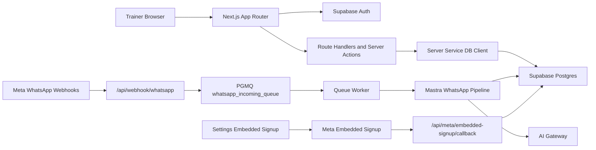

# NutriRelay

## Problem

NutriRelay helps nutrition coaches manage WhatsApp-first meal updates, trainer review queues, client adherence context, and weekly reporting without relying on scattered chat history.

## Target Users

- Independent nutrition trainers.
- Trainer operators who review client meal updates.
- Pilot clients who communicate through WhatsApp.

## My Role

Independent Product Builder.

I used AI-assisted development tools to accelerate implementation and investigation. I remained responsible for requirements, architecture decisions, reviewing generated changes, debugging, testing, validation, and final product decisions.

## Verified Stack

- Next.js App Router 16.2.7.
- React 19.2.4.
- TypeScript.
- Tailwind CSS 4.
- Supabase Auth and Postgres.
- Supabase SSR helpers.
- Vercel deployment.
- Vitest.
- Mastra workflows.
- Trigger.dev SDK.
- Meta WhatsApp webhook and Embedded Signup integration code.
- Google AI SDK routed through the project AI gateway.

## Architecture

## Major Workflows

- Public landing page with trainer-facing positioning and manual pilot pricing language.
- Supabase email/password registration and login.
- Middleware-protected dashboard routes.
- Trainer dashboard for clients, communications, reports, analytics, review, events, and WhatsApp development tools.
- Trainer/client ownership checks in current trainer API routes.
- WhatsApp inbound webhook ingestion, signature verification in production, status persistence, queue insertion, worker processing, and duplicate handling.
- Embedded Signup callback that stores WABA and phone metadata under the authenticated trainer context.

## Authentication

- `src/utils/supabase/middleware.ts` uses Supabase SSR and `auth.getUser()` to validate sessions.
- `/dashboard`, `/admin`, and `/onboarding` routing decisions are enforced in middleware.
- `/login` uses a server action and redirects invalid credentials to a generic error.
- `/register` uses Supabase browser signup with trainer metadata and routes confirmed sessions to onboarding.

## Multi-Tenant Isolation

- Core migrations enable RLS on public tables and define trainer/client policies.
- Current trainer API routes call `requireTrainer()` or `requireTrainerContext()` rather than trusting caller-supplied `trainer_id`.
- Service-role database access is used server-side, so route and service ownership checks are critical.
- WhatsApp inbound tenant resolution first identifies the trainer by receiver `phone_number_id`, then resolves sender phone inside that trainer scope.
- `trainer_waba_credentials` is treated as server-side credential storage and is not exposed to browser clients.

## API And Integration Design

- `/api/trainer/*` routes expose authenticated dashboard data and mutations.
- `/api/webhook/whatsapp` handles Meta verification and inbound messages.
- `/api/webhooks/whatsapp` is intentionally deprecated and returns 410.
- `/api/whatsapp/test-send` exists for controlled WhatsApp test sends.
- `/api/meta/embedded-signup/callback` exchanges Meta auth codes server-side and stores credential metadata.

## Hard Technical Problems

- Maintaining tenant isolation while using service-role clients for server workflows.
- Mapping WhatsApp inbound messages to the correct trainer/client when multiple trainers can use WhatsApp.
- Handling webhook retries and duplicate `wam_id` values with queue claim state.
- Keeping trainer review control in AI-assisted meal parsing workflows.
- Separating public Meta launcher IDs from server-only app secrets and access tokens.

## Testing

- Unit tests exist under `tests/unit`.
- Vitest is configured in `vitest.config.ts`.
- Regression commands include TypeScript, ESLint, Vitest, and Next production build.
- QA documentation and a sanitized Postman collection live under `qa/`.

## Current Limitations

- Live WhatsApp completion should not be claimed without real send, delivery/status, inbound, and dashboard evidence.
- Current working tree contains uncommitted changes that may differ from production.
- Supabase security advisor output was not available in this run.
- The public landing page was verified manually, but no automated Playwright dependency is currently installed.
- Billing is documented as manual QR/UPI/operator verification, not automated payment processing.

## CV Evidence

| CV Claim | Evidence | Confidence | Recommendation |
| --- | --- | --- | --- |
| React | React 19 app components and dashboard UI | High | Keep |
| Next.js | App Router routes, middleware, metadata, API routes | High | Keep |
| TypeScript | Strict TS codebase and typecheck script | High | Keep |
| Tailwind CSS | Tailwind 4 and utility-heavy UI | High | Keep |
| Supabase | Auth, SSR, Postgres, migrations, RLS | High | Keep |
| PostgreSQL and SQL | Supabase migrations, PGMQ, direct `pg` workflow queries | High | Keep |
| REST APIs | `/api/trainer`, `/api/webhook`, `/api/meta` routes | High | Keep |
| Authentication | Supabase Auth login/register/middleware | High | Keep |
| RLS | RLS migrations and policies exist | Medium | Keep with wording: "implemented and audited RLS-backed tenant model" |
| Webhooks | Meta WhatsApp webhook route and signature verification | High | Keep |
| Queues | PGMQ queue worker and claim/retry handling | High | Keep |
| Multi-tenant architecture | trainer/client ownership checks and tenant resolver | Medium | Keep with transparent limitations |
| Functional testing | Vitest suite and QA docs | Medium | Keep |
| API testing | Sanitized Postman collection added | Medium | Keep after running it in staging |
| Payments | Manual billing model only | Low | Do not claim payment gateway integration |
| Production WhatsApp automation complete | Partial implementation | Low | Do not claim complete without live evidence |

## Supported CV Bullets

- Built a Next.js, TypeScript, Supabase SaaS dashboard for trainer-led nutrition operations and WhatsApp-based meal review workflows.
- Implemented Supabase Auth, protected dashboard routing, and trainer/client ownership checks for multi-tenant data access.
- Designed WhatsApp webhook ingestion with signature verification, status persistence, queueing, duplicate handling, and AI-assisted meal processing.
- Added QA artifacts, regression tests, and API checklists to document authentication, RLS, API, and webhook validation paths.
- Used AI-assisted development responsibly while retaining ownership of requirements, architecture decisions, code review, debugging, testing, and final acceptance.
